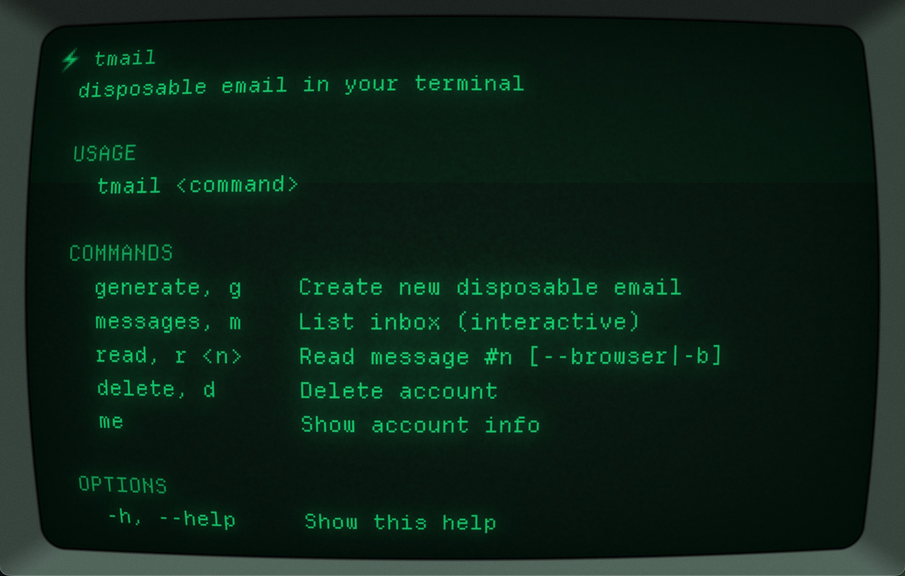

# tmail

Disposable email in your terminal.



## Install

```bash
brew install aayush9029/tap/tmail
```

## Usage

```bash
tmail generate          # create a new disposable email (copied to clipboard)
tmail messages          # list inbox (select to open in Safari)
tmail read 1            # read message #1
tmail read 1 --browser  # open in Safari
tmail me                # show account info
tmail delete            # delete account
```

---

*More CLI tools: [`brew tap aayush9029/tap`](https://github.com/Aayush9029/homebrew-tap)*
